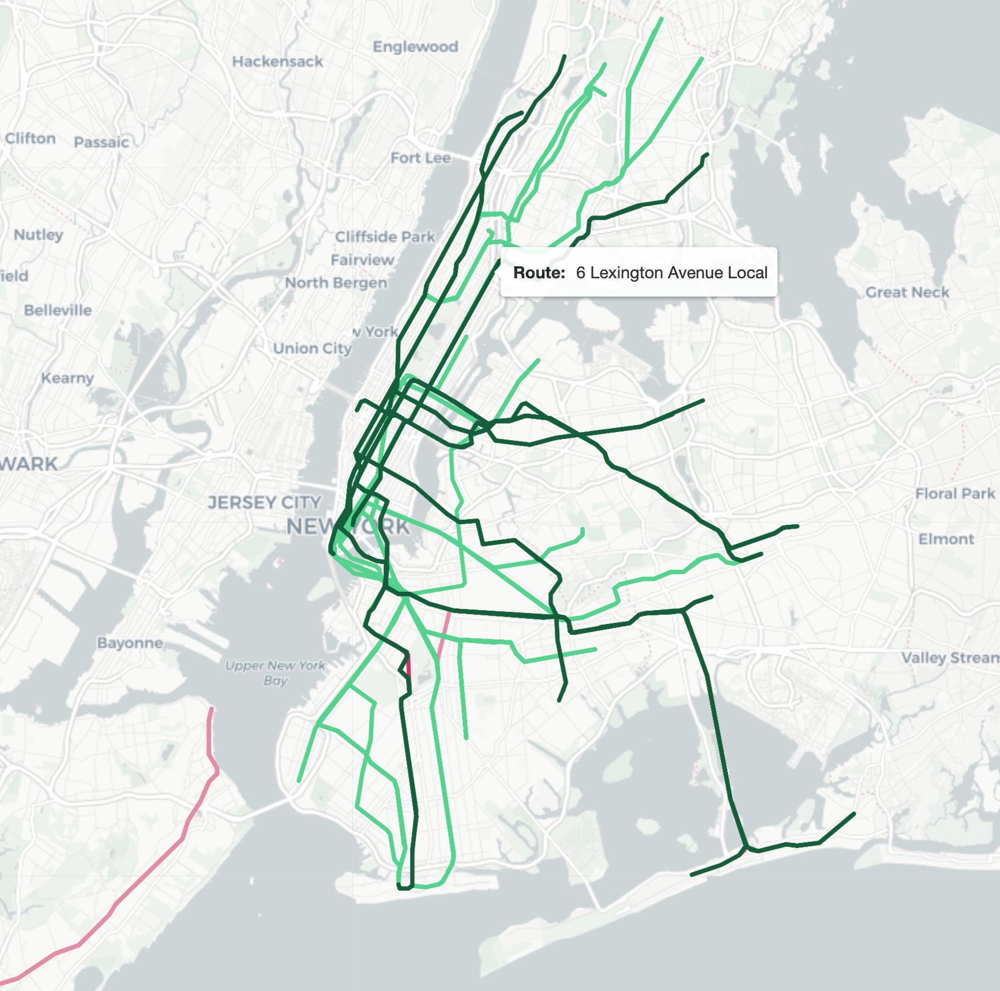
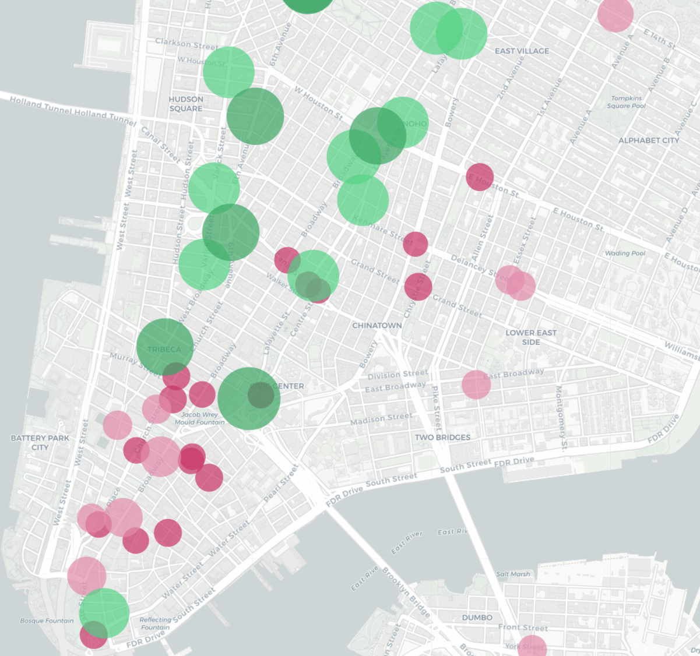
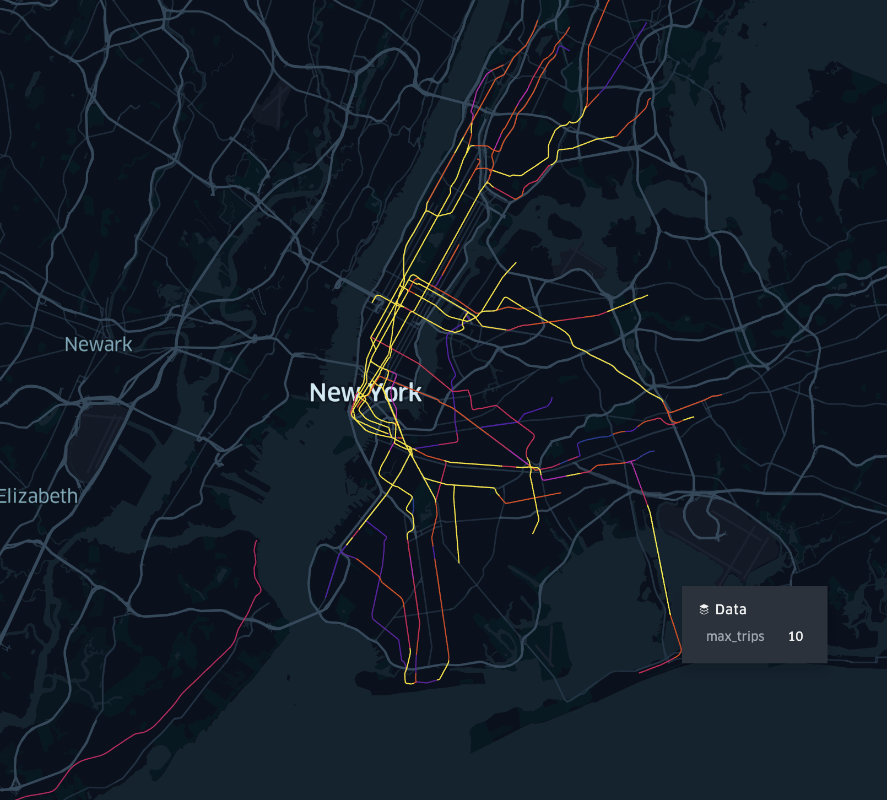
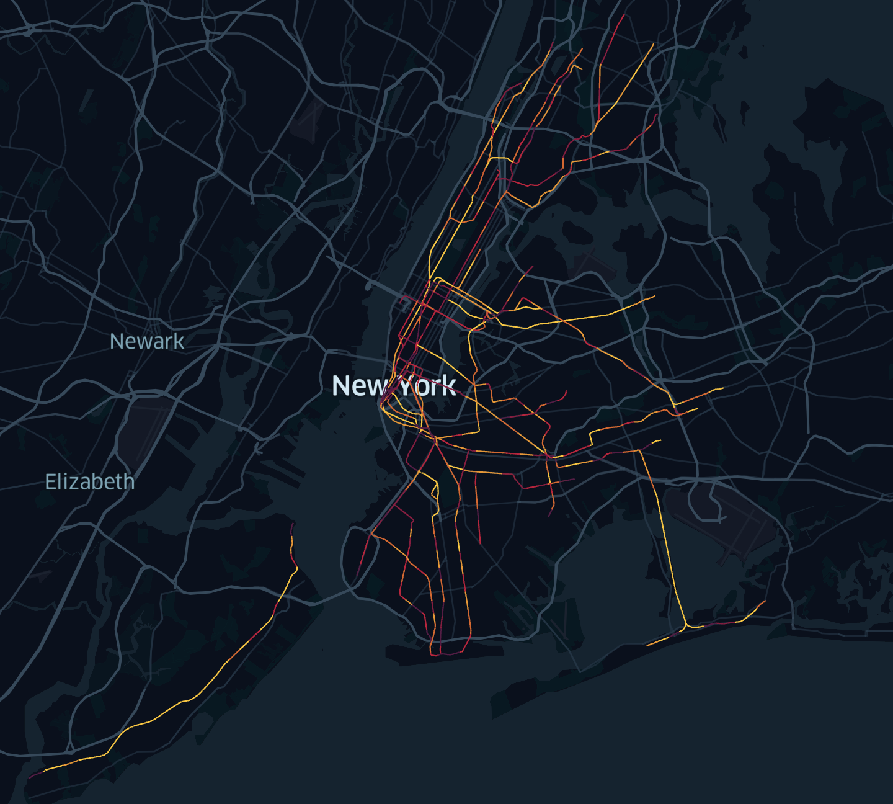
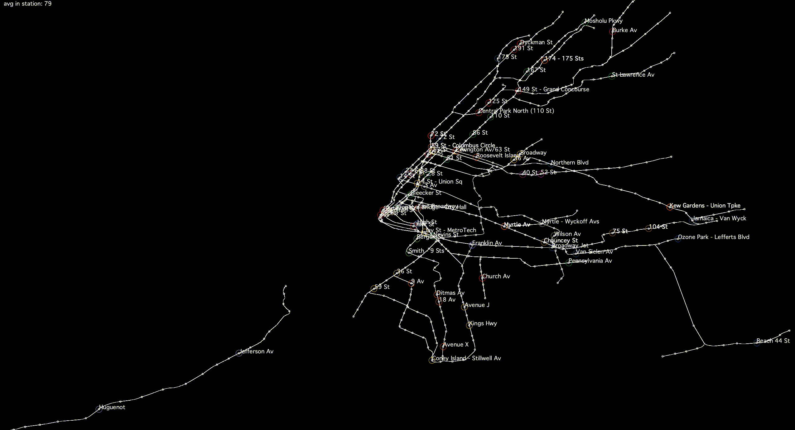
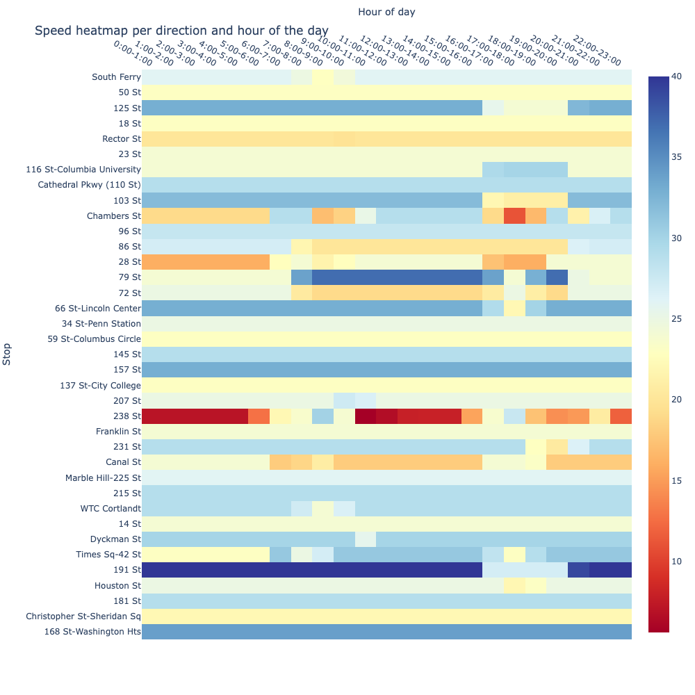

# NYC Subway Network Exporation

Analysis, visualization and simulation of NYC subway system.

 

## Datasets

### GTFS feed: MTA New York City Transit (MTA)

* Archive GTFS feed of New York City Transit Subway
* Record the headway information for all the subway lines
* [GTFS feed specification](https://gtfs.org/schedule/reference/)
* Download data from [transitland](https://www.transit.land/feeds/f-dr5r-mtanewyorkcitytransit/)

### MTA Turnstile Data

* Entrance number and exit number are recorded every 4 hour
* Update weekly
* Download from [MTA](http://web.mta.info/developers/turnstile.html)

## Turnstile Visulalizaton

### Route Map & Turnstile Heatmap

  

### Turnstile Animation

## GTFS Visualization

### Flow Segment & Speed Segment

  

### Headway animations

 

### Speed per Stop and Hour of the Day

## To Do
* Plot Subway Fundamental Diagram based on simulation
* Conduct System simulation on Anylogic

## Acknowledgments

Inspiration:
* [GTFS_transit_visualizer](https://github.com/rev3rend/GTFS_transit_visualizer)
* [NYC-Transport](https://github.com/r-shekhar/NYC-transport)
* [nycturnstiles](https://github.com/chriswhong/nycturnstiles)
* [Data Visualization with Processing](https://github.com/juanfrans-courses/DataScienceSocietyWorkshop)
* [AnyLogic-Models](https://github.com/nitman118/AnyLogic-Models)
* [transitland-processing-animation](https://github.com/transitland/transitland-processing-animation)
* [MTADashV](https://github.com/kakun45/MTADashVisualization)
* [Traffic-Flow-Fundamental-Diagram](https://github.com/ChengTraffic/Traffic-Flow-Fundamental-Diagram)
* [mta_turnstile_exploratory_data_analysis](https://github.com/vincent-thompson/mta_turnstile_exploratory_data_analysis)
* [nyc_subway_network](https://github.com/yuanviola/nyc_subway_network)
* [NYC Turnstile EDA](https://github.com/sauer3/NYC_turnstile_EDA)
* [New York City Subway Usage](https://toddwschneider.com/dashboards/nyc-subway-turnstiles/#notes)
* [General Transit Feed Specification](https://gtfs.org/resources/gtfs/)
